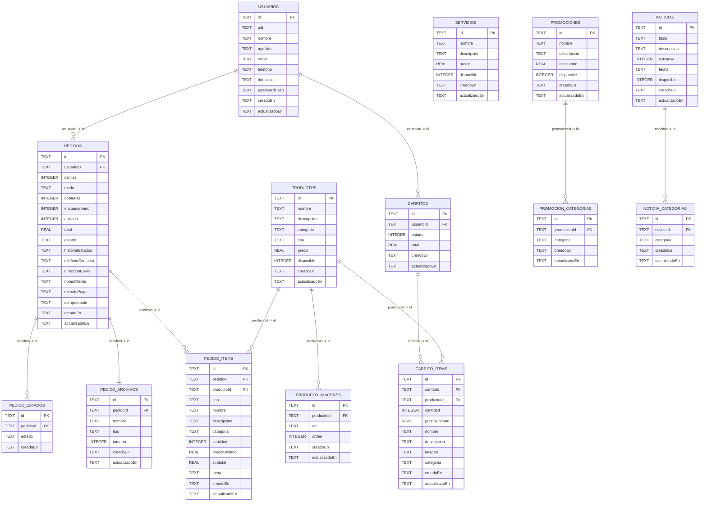

# La Montana Printing Management Web

Academic/portfolio project designed to run locally. This public repository is intentionally open so anyone can clone, inspect, modify, and experiment in their own environment.

Proyecto academico/de portfolio pensado para ejecutarse en local. Este repositorio publico esta abierto a proposito para que cualquiera pueda clonar, inspeccionar, modificar y experimentar en su propio entorno.

---

## 1) Overview | Resumen
A full-stack web app for a digital print shop workflow:
- React SPA for landing, catalog, news/promos, cart, profile, and print orders.
- Express REST API.
- Local SQLite database.
- Email/password auth plus optional Google Sign-In.
- Session cookie (HttpOnly).

Aplicacion web full-stack para el flujo de una imprenta digital:
- SPA en React para landing, catalogo, noticias/promos, carrito, perfil y pedidos de impresion.
- API REST con Express.
- Base de datos SQLite local.
- Autenticacion por email/password y Google Sign-In opcional.
- Cookie de sesion (HttpOnly).

## 2) Functional Scope | Alcance funcional
Typical user flow:
1. Browse catalog and promotions.
2. Sign in or create account.
3. Add products to cart.
4. Adjust quantities and shipping info.
5. Create print/copy order.

Flujo tipico de usuario:
1. Navegar catalogo y promociones.
2. Iniciar sesion o crear cuenta.
3. Agregar productos al carrito.
4. Ajustar cantidades y datos de envio.
5. Crear pedido de impresiones/copias.

## 3) Architecture | Arquitectura
Monorepo with npm workspaces:
- `server`: backend API + SQLite.
- `vite-project`: frontend React + Vite.
- root scripts: orchestrate both services with `concurrently`.

Monorepo con workspaces npm:
- `server`: backend API + SQLite.
- `vite-project`: frontend React + Vite.
- scripts de raiz: orquestan ambos servicios con `concurrently`.

### Tech Stack | Stack tecnico
| Layer | Technologies |
|---|---|
| Frontend | React 19, React Router 6 (`HashRouter`), Vite 7, CSS, ESLint |
| Backend | Node.js, Express 5, express-validator, JWT, bcrypt, cookie-parser, CORS |
| Data | SQLite (`better-sqlite3`) |
| Social auth | Google Identity Services + `google-auth-library` |

## 4) Repository Structure | Estructura del repositorio
```text
.
├─ server/
│  ├─ database/
│  │  ├─ db.js
│  │  ├─ schema.sql
│  │  └─ seedInicial.js
│  ├─ src/
│  │  ├─ controllers/
│  │  ├─ middlewares/
│  │  ├─ routes/
│  │  ├─ utils/
│  │  └─ validators/
│  └─ .env.example
├─ vite-project/
│  ├─ src/
│  │  ├─ components/
│  │  ├─ context/
│  │  ├─ routes/
│  │  ├─ services/
│  │  └─ config/
│  └─ public/
├─ package.json
└─ readme.md
```

---

## 5) Database ERD | DER de base de datos


Compatibility note: legacy JSON columns (`items`, `categorias`, `archivo`, `historialEstados`) are still present for migration compatibility, while backend logic prioritizes normalized relational tables.

Nota de compatibilidad: se mantienen columnas JSON legacy (`items`, `categorias`, `archivo`, `historialEstados`) por compatibilidad de migracion, mientras que la logica del backend prioriza las tablas relacionales normalizadas.

---

## 6) API Summary | Resumen de API
Local base URL: `http://localhost:3000/api`

### Public endpoints | Endpoints publicos
| Method | Path | Description |
|---|---|---|
| GET | `/salud` | API healthcheck / estado de API |
| POST | `/usuarios` | Register user / registrar usuario |
| POST | `/usuarios/login` | Email/password login |
| POST | `/usuarios/google` | Google login/register (`idToken`) |
| POST | `/usuarios/logout` | Logout / cerrar sesion |
| GET | `/catalogo` | Product + service catalog |
| GET | `/noticias` | News + promotions |
| GET | `/servicios` | Services list / tarifas |

### Protected endpoints | Endpoints protegidos
| Method | Path | Description |
|---|---|---|
| GET | `/usuarios` | List users / listar usuarios |
| GET | `/usuarios/:id` | User profile / perfil |
| PUT | `/usuarios/:id` | Update profile / actualizar perfil |
| GET | `/carritos` | Get/create active cart |
| POST | `/carritos/items` | Add product to cart |
| PATCH | `/carritos/:carritoId/items/:productoId` | Update quantity |
| DELETE | `/carritos/:carritoId/items/:productoId` | Remove item |
| POST | `/pedidos` | Create order / crear pedido |

---

## 7) Environment Variables | Variables de entorno

### Backend (`server/.env`)
| Variable | Required | Default | Description |
|---|---|---|---|
| `JWT_SECRET` | Yes | - | JWT signing secret |
| `JWT_EXP` | No | `2h` | Token expiration |
| `SKIP_SEED` | No | `false` | Skip initial seed |
| `SQLITE_DB_PATH` | No | `server/database/lamontana.db` | SQLite file path |
| `CORS_ORIGINS` | No | `http://localhost:5173,http://127.0.0.1:5173` | CORS whitelist |
| `GOOGLE_CLIENT_ID` | No | - | Google OAuth web client id |
| `AUTH_COOKIE_NAME` | No | `auth_token` | Session cookie name |
| `AUTH_COOKIE_MAX_AGE_MS` | No | `7200000` | Session cookie duration |

### Frontend (`vite-project/.env`)
| Variable | Required | Default | Description |
|---|---|---|---|
| `VITE_API_BASE_URL` | No | `http://localhost:3000/api` | API base URL |
| `VITE_GOOGLE_CLIENT_ID` | No | - | Google button client id |

---

## 8) Installation and Run | Instalacion y ejecucion

### Requirements | Requisitos
- Node.js `>= 20`
- npm
- Git

### Linux / macOS
```bash
git clone https://github.com/agusft/lamontana-printing-management-web.git
cd lamontana-printing-management-web
npm install
cp server/.env.example server/.env
# Edit server/.env: at minimum set JWT_SECRET
npm run dev
```

### Windows (PowerShell)
```powershell
git clone https://github.com/agusft/lamontana-printing-management-web.git
cd .\lamontana-printing-management-web
npm install
Copy-Item .\server\.env.example .\server\.env
# Edit .\server\.env: at minimum set JWT_SECRET
npm run dev
```

Running services | Servicios levantados:
- Backend: `http://localhost:3000`
- Frontend: `http://localhost:5173` (or next available port)

Frontend routes (`HashRouter`) | Rutas frontend (`HashRouter`):
- Home: `http://localhost:5173/#/`
- Cart: `http://localhost:5173/#/carrito`
- Profile: `http://localhost:5173/#/mis-datos`
- Print orders: `http://localhost:5173/#/impresiones`

## 9) Scripts | Scripts
### Root
- `npm run dev` -> run backend + frontend.
- `npm run dev:server` -> backend only.
- `npm run dev:front` -> frontend only.

### Frontend (`vite-project`)
- `npm run dev`
- `npm run build`
- `npm run preview`
- `npm run lint`

### Backend (`server`)
- `npm run dev`
- `npm run start`

## 10) Quick Local Validation | Verificacion rapida local
```bash
npm --prefix vite-project run lint
npm --prefix vite-project run build
cd server && npm run start
```

## 11) Google Sign-In (Optional) | Google Sign-In (opcional)
1. Create a Google Cloud OAuth web credential.
2. Add `http://localhost:5173` to authorized JavaScript origins.
3. Set the same client id in:
   - `server/.env` -> `GOOGLE_CLIENT_ID`
   - `vite-project/.env` -> `VITE_GOOGLE_CLIENT_ID`
4. Restart frontend and backend.

1. Crear credencial OAuth web en Google Cloud.
2. Agregar `http://localhost:5173` en origenes JavaScript autorizados.
3. Configurar el mismo client id en:
   - `server/.env` -> `GOOGLE_CLIENT_ID`
   - `vite-project/.env` -> `VITE_GOOGLE_CLIENT_ID`
4. Reiniciar frontend y backend.

## 12) Test Account | Usuario de prueba
Created by seed:
- Email: `prueba@prueba.com`
- Password: `targetgtr`

Creado por seed:
- Email: `prueba@prueba.com`
- Password: `targetgtr`

## 13) Session Model | Modelo de sesion
- Backend issues HttpOnly session cookie on login/register.
- Frontend uses `credentials: "include"` on protected requests.
- UI stores only basic user state in `localStorage` (no session token).

- El backend emite cookie de sesion HttpOnly al iniciar/crear cuenta.
- El frontend usa `credentials: "include"` en requests protegidos.
- La UI guarda solo estado basico de usuario en `localStorage` (sin token de sesion).

## 14) Troubleshooting | Problemas comunes
- Import errors on Linux (`Does the file exist?`): check case-sensitive paths.
- CORS blocked: verify `CORS_ORIGINS` in `server/.env`.
- Google button not showing: missing `VITE_GOOGLE_CLIENT_ID` or mismatch with backend value.
- Port `5173` already used: Vite auto-falls back to `5174+`.
- Reset local data: delete `server/database/lamontana.db` and restart backend.

- Error de imports en Linux (`Does the file exist?`): revisar mayusculas/minusculas en paths.
- CORS bloqueado: validar `CORS_ORIGINS` en `server/.env`.
- Boton Google no aparece: falta `VITE_GOOGLE_CLIENT_ID` o hay mismatch con backend.
- Puerto `5173` ocupado: Vite sube automaticamente a `5174+`.
- Reset de datos locales: borrar `server/database/lamontana.db` y reiniciar backend.

---

## 15) Portfolio Context | Contexto de portfolio
This project is optimized for local execution, technical review, and code inspection by recruiters and developers.

Este proyecto esta optimizado para ejecucion local, evaluacion tecnica e inspeccion de codigo por recruiters y desarrolladores.
